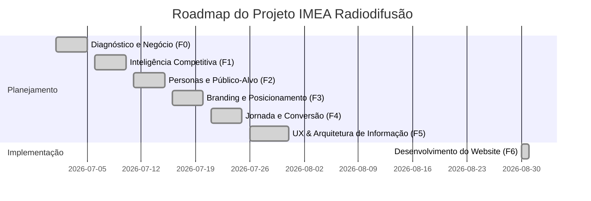

# Status do Projeto — IMEA Radiodifusão

Este documento apresenta o diagnóstico e o progresso da reformulação do ecossistema digital da **IMEA Radiodifusão**.

---

## 📊 Resumo do Status Atual

O projeto passou com sucesso da fase de planejamento para a entrega total da solução de desenvolvimento. **Toda a codificação e compilação do site de alta performance (Fase F6) estão concluídas**. A marca pública foi atualizada para IMEA Radiodifusão, mantendo o domínio adencon.com.br e os dados legais.



---

## 🛠️ Stack Tecnológica & Arquitetura

- **Framework:** [Astro v4](https://astro.build/) (otimizado para carregamento estático e SEO ultrarrápido).
- **Estilização:** [Tailwind CSS v3](https://tailwindcss.com/) (com paleta corporativa Navy, Sky e Slate).
- **Ambiente de Build:** Enjaulado em contêiner [Podman](https://podman.io/) (`node:22-alpine`) para garantir reprodutibilidade sem poluir o sistema operacional host.

---

## 📂 Mapeamento de Arquivos Implementados

### Estrutura Base & Layout
- [`website/src/config.ts`](file:///var/home/fernando/Workspace/clients/adencon/website/src/config.ts): Centralização de telefone, WhatsApp, CNPJ e e-mails corporativos.
- [`website/src/layouts/Layout.astro`](file:///var/home/fernando/Workspace/clients/adencon/website/src/layouts/Layout.astro): HTML5 semântico, inclusão de fontes (Inter), meta tags para SEO e viewport.
- [`website/src/components/Header.astro`](file:///var/home/fernando/Workspace/clients/adencon/website/src/components/Header.astro): Menu responsivo com dropdown de soluções e drawer móvel.
- [`website/src/components/Footer.astro`](file:///var/home/fernando/Workspace/clients/adencon/website/src/components/Footer.astro): Mapa do site, informações institucionais, CNPJ e direitos.
- [`website/src/components/FloatingWhatsapp.astro`](file:///var/home/fernando/Workspace/clients/adencon/website/src/components/FloatingWhatsapp.astro): Botão flutuante animado (breathing effect).
- [`website/src/components/CardUrgencia.astro`](file:///var/home/fernando/Workspace/clients/adencon/website/src/components/CardUrgencia.astro): Alerta visual e CTA de contato urgente com especialistas da Anatel/MCom.

### Páginas & Rotas
- [`website/src/pages/index.astro`](file:///var/home/fernando/Workspace/clients/adencon/website/src/pages/index.astro): Landing page principal baseada em wireframe conceitual, contendo prova de autoridade, passo a passo do fluxo e CTAs de contato.
- [`website/src/pages/radio-comunitaria.astro`](file:///var/home/fernando/Workspace/clients/adencon/website/src/pages/radio-comunitaria.astro): Página de conversão longa e copywriting adaptado à persona prioritária de rádios comunitárias.
- [`website/src/pages/solucoes/regularizacao-de-radio-comunitaria.astro`](file:///var/home/fernando/Workspace/clients/adencon/website/src/pages/solucoes/regularizacao-de-radio-comunitaria.astro): Wrapper automático sem duplicação de rota.
- [`website/src/pages/solucoes/renovacao-de-outorga.astro`](file:///var/home/fernando/Workspace/clients/adencon/website/src/pages/solucoes/renovacao-de-outorga.astro): Trata das licenças expiradas/a vencer.
- [`website/src/pages/solucoes/defesa-administrativa-anatel.astro`](file:///var/home/fernando/Workspace/clients/adencon/website/src/pages/solucoes/defesa-administrativa-anatel.astro): Focado em impugnações técnicos da Anatel.
- [`website/src/pages/solucoes/contratos-e-documentacao.astro`](file:///var/home/fernando/Workspace/clients/adencon/website/src/pages/solucoes/contratos-e-documentacao.astro): Gestão de alterações e estatutos societários.
- [`website/src/pages/solucoes/consultoria-em-radiodifusao.astro`](file:///var/home/fernando/Workspace/clients/adencon/website/src/pages/solucoes/consultoria-em-radiodifusao.astro): Viabilidade técnica de potências e espectro de rádio/TV.
- [`website/src/pages/sobre.astro`](file:///var/home/fernando/Workspace/clients/adencon/website/src/pages/sobre.astro): História dos fundadores Dr. Ivan Alves e Iara Marques Roberto Alves.
- [`website/src/pages/contato.astro`](file:///var/home/fernando/Workspace/clients/adencon/website/src/pages/contato.astro): Canais diretos de telefone fixo, e-mail e localização.
- [`website/src/pages/diagnostico-inicial.astro`](file:///var/home/fernando/Workspace/clients/adencon/website/src/pages/diagnostico-inicial.astro): Formulário dinâmico inteligente que compõe a resposta e abre o WhatsApp com os campos pré-preenchidos.
- [`website/src/pages/conteudos/index.astro`](file:///var/home/fernando/Workspace/clients/adencon/website/src/pages/conteudos/index.astro): Redirect 301 de compatibilidade para a central editorial `/blog`.
- [`website/src/pages/checklist-radio-comunitaria.astro`](file:///var/home/fernando/Workspace/clients/adencon/website/src/pages/checklist-radio-comunitaria.astro): Ímã de leads imprimível em formato A4.

---

## 🚀 Como Executar e Implantar

### Desenvolvimento Local (Live Reload)
Para rodar o servidor de desenvolvimento interno usando o Podman na porta `4321`:
```bash
podman run --rm -it -v "/var/home/fernando/Workspace/clients/adencon/website:/app" -w /app -p 4321:4321 node:22-alpine npm run dev -- --host
```

### Compilar Estaticamente (Gerar Pasta `dist/`)
Para re-gerar os arquivos finais:
```bash
podman run --rm -v "/var/home/fernando/Workspace/clients/adencon/website:/app" -w /app node:22-alpine npm run build
```
Os arquivos gerados residem no diretório [`website/dist/`](file:///var/home/fernando/Workspace/clients/adencon/website/dist) e contêm apenas arquivos estáticos puros (zero dependência de bancos de dados ou Node de produção).

### Hospedagem no Cloudflare Pages
Como o site é 100% estático e focado em alto desempenho, a implantação na infraestrutura do Cloudflare Pages pode ser feita de duas formas:
1. **GitHub/GitLab Integrado (Recomendado):**
   - Conecte o repositório no painel do Cloudflare Pages.
   - Defina a stack como **Astro**.
   - Defina a pasta de saída/diretório de build como `dist`.
   - Build command: `npm run build`.
2. **Upload Direto:**
   - Faça upload direto da pasta compilada local [`website/dist/`](file:///var/home/fernando/Workspace/clients/adencon/website/dist) por meio da interface arrasta-e-solta (drag and drop) do Cloudflare Pages.
